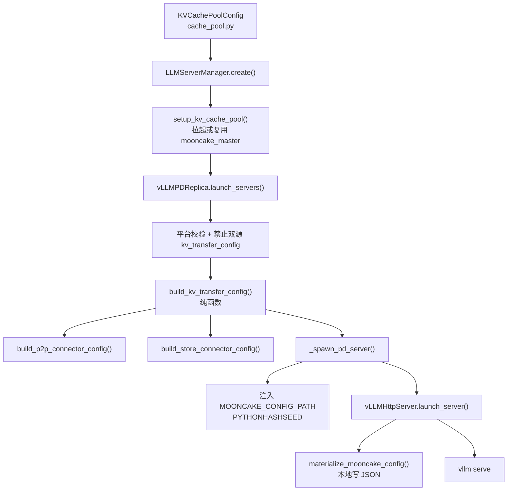
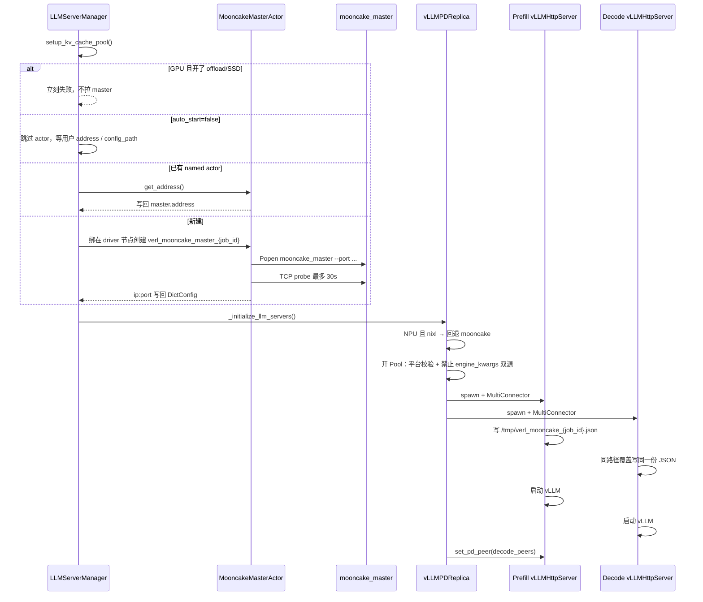
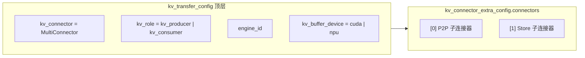
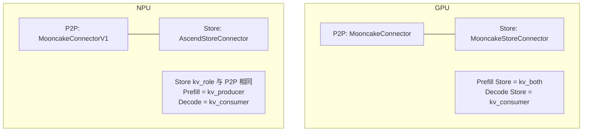
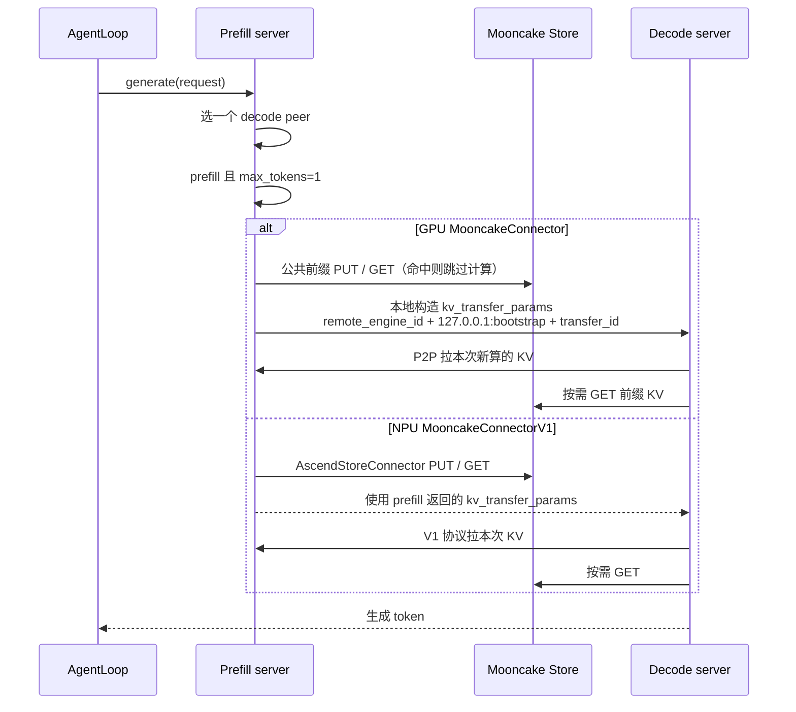

# verl vLLM 后端 KV Cache Pool 方案讲解

日期：2026-09-11  
范围：如何让 **vLLM PD（Prefill/Decode 分离）** 同时拥有 P2P KV 传输和共享 KV Cache Pool。

配套文档：

- 用户开关与示例：`docs/perf/rollout_kv_offload.md`

---

## 1. 一句话先讲清楚

开启 `cache_pool` 后，verl 不再只给 vLLM 配一个 P2P 连接器，而是组装成：

```text
MultiConnector = [P2P 连接器, Store 连接器]
```

- **P2P**：这次请求的 Prefill 实例把刚算出的 KV 直接传给 Decode 实例。
- **Store（Pool）**：同一 Ray Job 里所有 P/D 实例共享一块 Mooncake 存储。公共前缀（系统提示、工具历史、`rollout.n` 多样本）命中后，不必反复 prefill。

GPU 和 NPU 走同一套 verl 编排，但 **P2P / Store 的上游类名、JSON 字段、握手端口、PD 调度协议都不同**。

| 平台 | P2P | Store |
|---|---|---|
| GPU | `MooncakeConnector` | `MooncakeStoreConnector` |
| NPU | `MooncakeConnectorV1` | `AscendStoreConnector` |

---

## 2. 为什么非 PD 旁路不够用

非 PD（P/D 同机）本来就可以通过 `engine_kwargs.vllm.kv_transfer_config` 把 `MooncakeStoreConnector` 塞给 vLLM。  
PD 打开后，`vLLMPDReplica` 会自己生成 `kv_transfer_config`，把这条旁路覆盖掉。结果是：

- 关 PD：可以有 Store，没有 P2P。
- 开 PD、关 Pool：可以有 P2P，没有 Store。
- 开 PD、开 Pool：必须用 MultiConnector，两边都要。

两条路径互斥。PD 启动时如果发现 `engine_kwargs.vllm.kv_transfer_config` 非空，直接 `ValueError`。

开启条件（配置期校验）：

- `rollout.name=vllm`
- `disaggregation.enabled=true`
- `enable_prefix_caching=true`
- `transfer_backend` 属于 `mooncake` 或 `nixl`（NPU 上 `nixl` 会 remap 成 mooncake；GPU 上 `nixl + pool` 仍拒绝）

---

## 3. 模块怎么切

职责刻意拆开，replica 不再自己拼 MultiConnector 字典。



| 单元 | 文件 | 干什么 |
|---|---|---|
| 配置 | `verl/workers/config/cache_pool.py` | Hydra 字段、平台无关校验 |
| 接入 | `verl/workers/config/rollout.py` | `RolloutConfig.cache_pool`，要求 vLLM + PD + prefix cache |
| 纯函数 + master | `verl/workers/rollout/vllm_rollout/kv_cache_pool.py` | JSON、Store TP、MultiConnector、`MooncakeMasterActor` |
| Job 入口 | `verl/workers/rollout/llm_server.py` | `create()` 里先 `setup_kv_cache_pool()`，再起 replica |
| PD replica | `verl/workers/rollout/vllm_rollout/vllm_pd_replica.py` | 平台探测、端口、env、调用组装函数 |
| HTTP server | `verl/workers/rollout/vllm_rollout/vllm_async_server.py` | 落盘 JSON；`_pd_dispatch` 按 P2P 名字分支 |

---

## 4. 启动时序

一次 `ray.init()` 之后的同一个 driver（`get_job_id()`）共享 **一个** Mooncake Store 和 **一个** `mooncake_master`。这与是否 `ray job submit` 无关：`python -m verl.trainer.main_ppo` 同样有 JobID。



要点：

1. **先 master，后 replica**。GPU offload 在 `setup_kv_cache_pool()` 入口就拒绝，避免 master 起来了 replica 再炸。
2. Actor 名固定 `verl_mooncake_master_{job_id}`。同 driver 多次 `create()` 复用，不新起进程。
3. JSON 按节点本地落盘：`{tempdir}/verl_mooncake_{job_id}.json`。不依赖 NFS。只写 `master_server_address`，不注入 `MOONCAKE_MASTER`。
4. 用户给了 `store.config_path` 时不生成 JSON；此时 `auto_start` 必须是 false。
5. 每个 P/D 进程额外注入 `PYTHONHASHSEED`（默认 `0`），保证 Store key 哈希一致。

---

## 5. MultiConnector 长什么样

关 Pool：把 P2P 字段展平到顶层，形状与旧 PD 单连接器一致（含 NIXL）。  
开 Pool：顶层一定是 `MultiConnector`，`connectors` 顺序固定 `[P2P, Store]`。NIXL **不会**进入 MultiConnector。

`engine_id` 和 `kv_buffer_device` 只写在顶层，不复制进子连接器。verl 的 `set_pd_peer` / `_pd_dispatch` 需要它们。



Prefill 的顶层 `kv_role` 是 `kv_producer`，Decode 是 `kv_consumer`。Store 子连接器自己的 `kv_role` 见下一节，GPU / NPU 不一样。

`lookup_rpc_port` 不是用户可配端口，**一律写成该实例的 `engine_id`**（UUID hex）。上游把它当 IPC 后缀用，用来区分同一节点上多个 vLLM 进程的 lookup 通道。

---

## 6. GPU / NPU 对照

平台探测沿用 `is_torch_npu_available(check_device=False)`。校验分两层：

- 配置期（CPU 可跑）：开关、backend、master/store 互斥、prefix cache。
- replica 启动期：协议、SSD、对方平台专用字段、NPU `global_segment_size` 必须 1GB 对齐。

### 6.1 连接器与角色



GPU Prefill 的 Store 是 `kv_both`：既要把公共前缀写入 Pool，又要在命中时读出来。NPU 官方 PD 示例不这么拆，Store 角色跟 P2P 走。

### 6.2 P2P 子连接器

GPU（协议来自 `disaggregation.mooncake_protocol`，默认 `nvlink`）：

```json
{
  "kv_connector": "MooncakeConnector",
  "kv_role": "kv_producer",
  "kv_connector_extra_config": { "mooncake_protocol": "nvlink" }
}
```

NPU（必须带 `kv_port` 和两端 TP；`dp_size` 固定 1）：

```json
{
  "kv_connector": "MooncakeConnectorV1",
  "kv_role": "kv_producer",
  "kv_port": 31000,
  "kv_connector_extra_config": {
    "prefill": { "dp_size": 1, "tp_size": 4 },
    "decode": { "dp_size": 1, "tp_size": 2 }
  }
}
```

两套协议可以同时存在，而且本来就该分开：

- P2P 传输：`disaggregation.mooncake_protocol`（GPU 默认 `nvlink`）
- Store 传输：`cache_pool.store.protocol`（空值 → GPU `rdma`，NPU `ascend`）

不要把 P2P 的 `nvlink` 写进 Store JSON。

### 6.3 Store JSON

| 字段 | GPU | NPU |
|---|---|---|
| `mode` | 写 `embedded` | 不写 |
| `local_buffer_size` | 写 | 不写 |
| `protocol` 默认 | `rdma` | `ascend` |
| `enable_offload` | 硬编码 `false` | 不写这个 key |
| `enable_ssd_offload` | 不写 | 写；路径非空则为 true |
| `ssd_offload_path` | 配置非空直接报错 | SSD 开启时才写 |
| `preferred_segment` / `prefer_alloc_in_same_node` | 非默认报错 | 写入 JSON |
| `device_name` | 可用；与 `ib_device` 独立 | 必须 `""` |
| `global_segment_size` | 默认 `4GB` | 同样默认 `4GB`，且必须 1GB 对齐 |

GPU 本阶段不支持任何 offload：`enable_offload=true` → `NotImplementedError`，`ssd_offload_path` 非空 → `ValueError`。  
NPU 用 `ssd_offload_path` 开 SSD，忽略 `enable_offload`。开 SSD 时自动拉起的 master 会带 `--enable_offload=true`，server 启动前 `mkdir -p` 该目录。

### 6.4 GPU 独有：Store TP

非对称 TP 时（例如 Prefill TP=4、Decode TP=2），Store 里的 KV 布局需要一个能被两端整除的并行度。

- 默认：`store_tp_size = lcm(prefill_tp, decode_tp)`
- 用户显式给 `store_tp_size`：用该值，且禁止同时 `enable_store_tp_lcm=true`
- 多个 Prefill 且 TP 不一致时：自动改走 LCM 模式，写入 `enable_store_tp_lcm=true` + `prefill_tp_sizes`，不再写 `store_tp_size`
- 校验：对 Prefill TP 和 Decode TP 都要 `store_tp_size >= tp` 且能整除

NPU **不写** `store_tp_size`。非对称 TP 只出现在 NPU 的 P2P 子连接器 `prefill.tp_size` / `decode.tp_size`。

当前 `vLLMPDReplica` 仍拒绝 `prefill_replicas != 1`。LCM 辅助函数已经按多 P 实现，以后放开多 P 不用重写这段。

### 6.5 握手端口

| | GPU | NPU |
|---|---|---|
| 端口跨度 | 每个实例 1 个端口 | 每个实例 `tp` 个连续端口 |
| Prefill | 自己的 side channel = bootstrap | 同上，跨度 = prefill TP |
| Decode | 自己另有 side channel；bootstrap 指向 Prefill 那个端口 | 同上 |

NPU `MooncakeConnectorV1` 每个 TP rank 要自己的 `kv_port`，所以一次预留一段连续端口。GPU `MooncakeConnector` 只需要一个 bootstrap 端口。

### 6.6 NPU 上的 nixl remap

当前行为：

```text
配置期：pool + transfer_backend in {mooncake, nixl} 都允许
GPU 运行期：pool + nixl → ValueError
NPU 运行期：nixl → 打 warning，改成 mooncake，走 MooncakeConnectorV1
           然后再要求 remap 后必须是 mooncake
```

也就是说：NPU 用户即使写了 `transfer_backend=nixl`，开 Pool 时仍复用「Ascend 不支持 NixlConnector、回退 MooncakeConnectorV1」这条路径，不会把 NIXL 塞进 MultiConnector。GPU 没有这条回退，开 Pool 必须直接配 mooncake。

NPU 的 `backend` 字段预留了 `mooncake | memcache | yuanrong`，当前非 `mooncake` 在配置期就 `NotImplementedError`。

---

## 7. 一次请求怎么走

`_pd_dispatch` 看的是 **P2P 名字**，不是顶层 `MultiConnector`：

1. 顶层是 `MultiConnector` → 取 `connectors[0].kv_connector`
2. 否则用顶层 `kv_connector`
3. `connectors` 缺失或空 → `RuntimeError`



GPU `MooncakeConnector` 的 decode 端 **不信任** prefill 返回的 `kv_transfer_params`，verl 在 replica 里本地拼：

- `remote_engine_id` = prefill 的 `engine_id`
- `remote_bootstrap_addr` = `http://127.0.0.1:{prefill_side_channel_port}`
- `transfer_id` = 这次请求的 UUID

NPU V1 和（关 Pool 时的）NIXL 相反：必须用 prefill 返回的 params。不要把 `MooncakeConnectorV1` 当成 GPU 那套 bootstrap 协议。

Decode 路由仍然是 replica 内 radix / decode policy，**不用 Store 命中率做 cache-aware 调度**。

---

## 8. 权重更新时怎么保证正确性

RL 每轮更新权重后，上一份策略算出的 KV 不能复用。verl 不额外 flush `mooncake_master`，而是走每台 `vLLMHttpServer` 已有的：

```text
reset_prefix_cache(reset_connector=True)
```

wake / sleep / clear / abort 都会走到这里，本地 prefix cache 和 Store connector 一起清。需要 vLLM ≥ 0.22，更旧的版本可能清不干净 Mooncake master 里的残留。

---

## 9. 最小配置示例

GPU，1 个 Prefill（TP=4）+ 3 个 Decode（TP=2），不开 SSD：

```yaml
actor_rollout_ref.rollout:
  name: vllm
  tensor_model_parallel_size: 4
  enable_prefix_caching: true
  disaggregation:
    enabled: true
    transfer_backend: mooncake
    decode_replicas: 3
    decode_tensor_model_parallel_size: 2
  cache_pool:
    enabled: true
    store:
      global_segment_size: 4GB
```

NPU，对称 TP，开 SSD：

```yaml
actor_rollout_ref.rollout:
  name: vllm
  tensor_model_parallel_size: 4
  enable_prefix_caching: true
  disaggregation:
    enabled: true
    transfer_backend: mooncake
    decode_replicas: 3
  cache_pool:
    enabled: true
    store:
      global_segment_size: 4GB
      ssd_offload_path: /nvme/mooncake_offload
    master:
      client_ttl: 120   # SSD 建议自行设置，verl 不自动填
```

`auto_start=true` 时，GPU 机器需要 `mooncake_master` 在 PATH（包名 `mooncake-transfer-engine`），NPU 对应 `mooncake-transfer-engine-npu`。硬件相关 env（`LD_LIBRARY_PATH`、`ASCEND_GLOBAL_RESOURCE_CONFIG`、hugepage）不由 verl 注入。

---

## 10. 明确不做的事

- 非 PD 纯 Store：继续走 `engine_kwargs` 旁路，与 PD Pool 互斥
- GPU `standalone-store` / `mooncake_client` / GPU SSD / GPU `enable_offload`
- NPU `memcache` / `yuanrong` 实现
- 本阶段多 Prefill replica、PP > 1、跨节点单个 PD replica
- SGLang 的 KV Pool
- 用 Store 命中率驱动 decode 路由
- 探测 Mooncake 版本；非默认 `tenant_id` 需要用户自己保证 ≥ 0.3.12

---

## 11. 读代码的推荐顺序

1. `verl/workers/config/cache_pool.py` — 有哪些旋钮、什么时候在配置期失败  
2. `verl/workers/rollout/vllm_rollout/kv_cache_pool.py` 里的 `build_*` — GPU/NPU 字典长什么样  
3. 同文件的 `setup_kv_cache_pool` / `MooncakeMasterActor` — master 怎么起、怎么复用  
4. `vllm_pd_replica.py` 的 `launch_servers` 组 `kv_transfer_config`，`_spawn_pd_server` 注入 env 并转发  
5. `vllm_async_server.py` 的 `materialize_mooncake_config` 调用点和 `_pd_dispatch` — JSON 落盘与请求路径  
6. `tests/workers/rollout/test_kv_cache_pool_on_cpu.py` — 用断言当说明书
