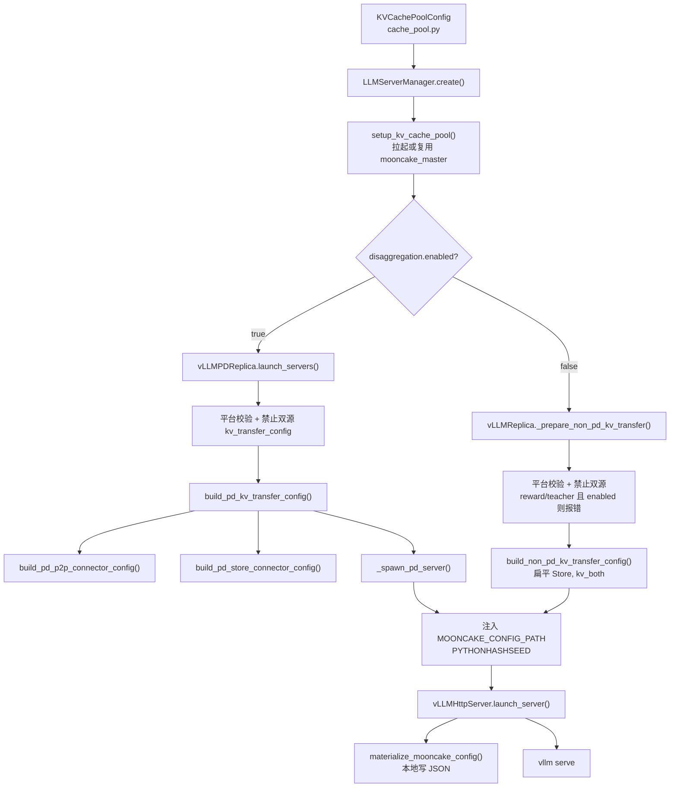
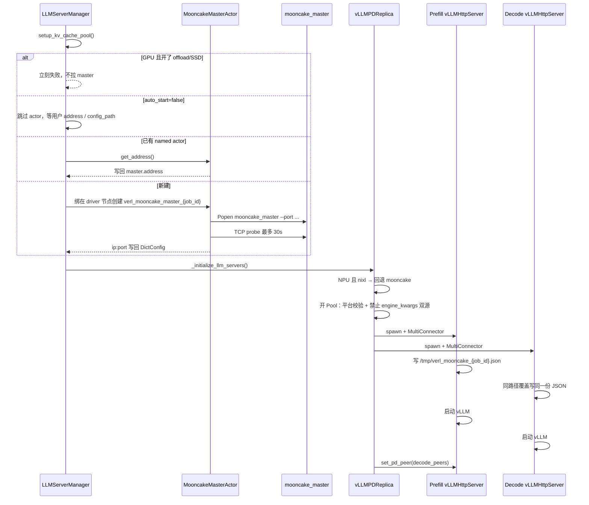
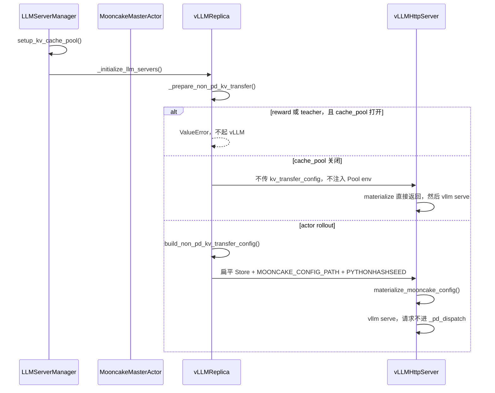
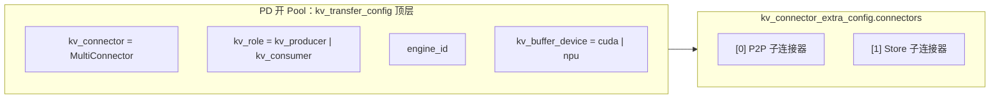
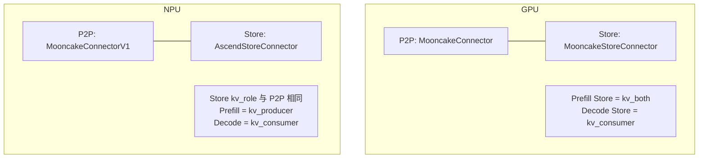
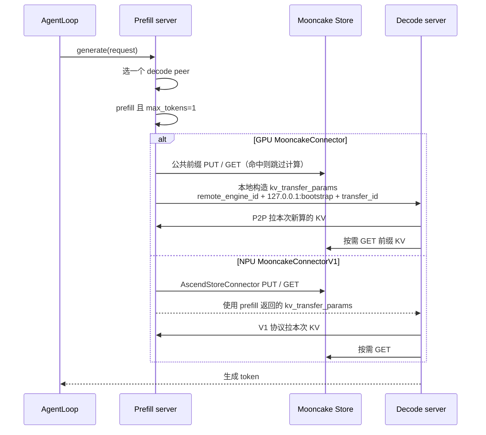
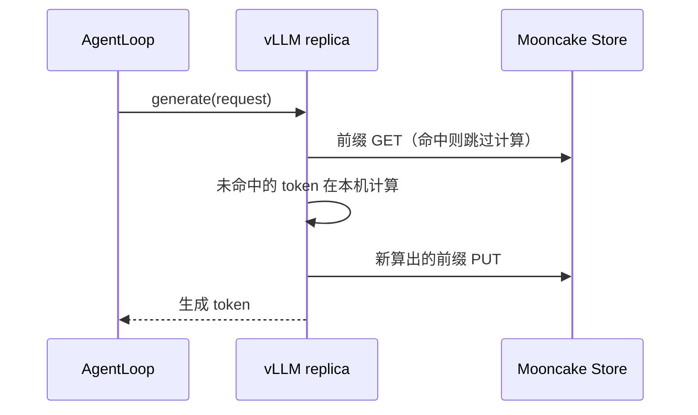

# verl vLLM 后端 KV Cache Pool 方案讲解

日期：2026-09-24  
范围：vLLM 开 `cache_pool` 后怎么挂共享 KV Cache Pool。PD 是 P2P + Store；非 PD 只有一个 Store。

配套文档：

- 用户开关与示例：`docs/perf/rollout_kv_offload.md`

---

## 1. 一句话先讲清楚

`cache_pool.enabled=true` 有两种组装，取决于是否开 PD：

```text
非 PD：一个扁平 Store 连接器，kv_role = kv_both
PD：  MultiConnector = [P2P 连接器, Store 连接器]
```

- **P2P**（仅 PD）：这次请求的 Prefill 实例把刚算出的 KV 直接传给 Decode 实例。
- **Store（Pool）**：同一 Ray Job 里挂上 Pool 的 vLLM 实例共享一块 Mooncake 存储。公共前缀（系统提示、工具历史、`rollout.n` 多样本）命中后，不必反复 prefill。

GPU 和 NPU 走同一套 verl 编排，但 **P2P / Store 的上游类名、JSON 字段、握手端口、PD 调度协议都不同**。非 PD 只用 Store 这一列。

| 平台 | P2P | Store |
|---|---|---|
| GPU | `MooncakeConnector` | `MooncakeStoreConnector` |
| NPU | `MooncakeConnectorV1` | `AscendStoreConnector` |

---

## 2. 两条路径

`cache_pool.enabled=true` 覆盖 PD 和非 PD。`engine_kwargs.vllm.kv_transfer_config` 与 Pool 互斥，启动时非空直接 `ValueError`。`cache_pool.enabled=false` 时仍可走这条手写旁路。

- 关 PD、开 Pool：单个 Store 连接器，`kv_role=kv_both`。GPU 是 `MooncakeStoreConnector`，NPU 是 `AscendStoreConnector`。没有 P2P，请求不进 `_pd_dispatch`。
- 开 PD、关 Pool：只有 P2P。
- 开 PD、开 Pool：`MultiConnector = [P2P, Store]`。

开启条件（配置期校验）：

- `rollout.name=vllm`
- `enable_prefix_caching=true`
- PD 额外要求 `disaggregation.enabled=true`，且 `transfer_backend` 属于 `mooncake` 或 `nixl`（NPU 上 `nixl` 会 remap 成 mooncake；GPU 上 `nixl + pool` 仍拒绝）
- 非 PD 忽略 `transfer_backend`。配置期只拒绝这些「打开」的值：`enable_store_tp_lcm=true`、非空 `prefill_tp_sizes`、`save_decode_cache=true`、`consumer_is_to_put=true`、`consumer_is_to_load=true`、非空 `prefill_pp_size` / `prefill_pp_layer_partition`。`enable_store_tp_lcm=false` 和空列表 `prefill_tp_sizes` 在配置期不拒绝。NPU 启动期仍要求 GPU 专用字段保持默认（`enable_store_tp_lcm` 默认是 `null`，`false` 会报 not supported on this platform）。`use_layerwise` 只属于 NPU memcache 的 Prefill，`backend` 不是 `memcache` 时拒绝；`backend=memcache` 随后因未实现而 `NotImplementedError`。GPU 的 `MooncakeStoreConnector` 没有 `use_layerwise`。

---

## 3. 模块怎么切

职责刻意拆开，replica 不再自己拼连接器字典。PD 走 MultiConnector，非 PD 走扁平 Store。


```mermaid
flowchart TB
    CFG["KVCachePoolConfig<br/>cache_pool.py"] --> MGR["LLMServerManager.create()"]
    MGR --> SETUP["setup_kv_cache_pool()<br/>拉起或复用 mooncake_master"]
    SETUP --> BRANCH{"disaggregation.enabled?"}
    BRANCH -->|true| PD["vLLMPDReplica.launch_servers()"]
    BRANCH -->|false| NPD["vLLMReplica._prepare_non_pd_kv_transfer()"]
    PD --> VAL["平台校验 + 禁止双源 kv_transfer_config"]
    NPD --> NVAL["平台校验 + 禁止双源<br/>reward/teacher 且 enabled 则报错"]
    VAL --> BUILD["build_pd_kv_transfer_config()"]
    BUILD --> P2P["build_pd_p2p_connector_config()"]
    BUILD --> STORE["build_pd_store_connector_config()"]
    BUILD --> SPAWN["_spawn_pd_server()"]
    NVAL --> NBUILD["build_non_pd_kv_transfer_config()<br/>扁平 Store, kv_both"]
    SPAWN --> ENV["注入 MOONCAKE_CONFIG_PATH<br/>PYTHONHASHSEED"]
    NBUILD --> ENV
    ENV --> HTTP["vLLMHttpServer.launch_server()"]
    HTTP --> JSON["materialize_mooncake_config()<br/>本地写 JSON"]
    HTTP --> VLLM["vllm serve"]
```

| 单元 | 文件 | 干什么 |
|---|---|---|
| 配置 | `verl/workers/config/cache_pool.py` | Hydra 字段、平台无关校验 |
| 接入 | `verl/workers/config/rollout.py` | `RolloutConfig.cache_pool`。vLLM + prefix cache；PD 再要求 disaggregation |
| 纯函数 + master | `verl/workers/rollout/vllm_rollout/kv_cache_pool.py` | JSON、Store TP、MultiConnector、非 PD 的单个 Store、`MooncakeMasterActor` |
| Job 入口 | `verl/workers/rollout/llm_server.py` | `create()` 里先 `setup_kv_cache_pool()`，再起 replica |
| PD replica | `verl/workers/rollout/vllm_rollout/vllm_pd_replica.py` | 平台探测、端口、env、调用 MultiConnector |
| 非 PD replica | `verl/workers/rollout/vllm_rollout/vllm_async_server.py` 的 `vLLMReplica` | `build_non_pd_kv_transfer_config()`。reward/teacher 打开 Pool 直接 `ValueError` |
| HTTP server | 同文件 `vLLMHttpServer` | 落盘 JSON；PD 走 `_pd_dispatch`，非 PD 把扁平 Store 配置写入 `vllm serve` |

---

## 4. 启动时序

一次 `ray.init()` 之后的同一个 driver（`get_job_id()`）共享 **一个** Mooncake Store 和 **一个** `mooncake_master`。这与是否 `ray job submit` 无关：`python -m verl.trainer.main_ppo` 同样有 JobID。PD 和非 PD 都先走 `setup_kv_cache_pool()`，后面分叉。

### 4.1 PD


```mermaid
sequenceDiagram
    participant Driver as LLMServerManager
    participant Actor0 as MooncakeMasterActor
    participant Master as mooncake_master
    participant Replica as vLLMPDReplica
    participant Prefill as Prefill vLLMHttpServer
    participant Decode as Decode vLLMHttpServer

    Driver->>Driver: setup_kv_cache_pool()
    alt GPU 且开了 offload/SSD
        Driver-->>Driver: 立刻失败，不拉 master
    else auto_start=false
        Driver->>Driver: 跳过 actor，等用户 address / config_path
    else 已有 named actor
        Driver->>Actor0: get_address()
        Actor0-->>Driver: 写回 master.address
    else 新建
        Driver->>Actor0: 绑在 driver 节点创建 verl_mooncake_master_{job_id}
        Actor0->>Master: Popen mooncake_master --port ...
        Actor0->>Master: TCP probe 最多 30s
        Actor0-->>Driver: ip:port 写回 DictConfig
    end

    Driver->>Replica: _initialize_llm_servers()
    Replica->>Replica: NPU 且 nixl → 回退 mooncake
    Replica->>Replica: 开 Pool：平台校验 + 禁止 engine_kwargs 双源
    Replica->>Prefill: spawn + MultiConnector
    Replica->>Decode: spawn + MultiConnector
    Prefill->>Prefill: 写 /tmp/verl_mooncake_{job_id}.json
    Decode->>Decode: 同路径覆盖写同一份 JSON
    Prefill->>Prefill: 启动 vLLM
    Decode->>Decode: 启动 vLLM
    Replica->>Prefill: set_pd_peer(decode_peers)
```

要点：

1. **先 master，后 replica**。GPU offload 在 `setup_kv_cache_pool()` 入口就拒绝，避免 master 起来了 replica 再炸。
2. Actor 名固定 `verl_mooncake_master_{job_id}`。同 driver 多次 `create()` 复用，不新起进程。
3. JSON 按节点本地落盘：`{tempdir}/verl_mooncake_{job_id}.json`。不依赖 NFS。只写 `master_server_address`，不注入 `MOONCAKE_MASTER`。
4. 用户给了 `store.config_path` 时不生成 JSON；此时 `auto_start` 必须是 false。
5. 每个挂上 Pool 的 vLLM 进程额外注入 `PYTHONHASHSEED`（默认 `0`），保证 Store key 哈希一致。PD 是每个 P/D 进程；非 PD 是每个 actor rollout replica。Reward / teacher 的 rollout 若 `cache_pool.enabled=true`，在组连接器之前 `ValueError`，不会去写 JSON。

### 4.2 非 PD

`disaggregation.enabled=false` 时 `get_rollout_replica_class` 选出 `vLLMReplica`，不进 `vLLMPDReplica`。


```mermaid
sequenceDiagram
    participant Driver as LLMServerManager
    participant Actor0 as MooncakeMasterActor
    participant Replica as vLLMReplica
    participant HTTP as vLLMHttpServer

    Driver->>Driver: setup_kv_cache_pool()
    Driver->>Replica: _initialize_llm_servers()
    Replica->>Replica: _prepare_non_pd_kv_transfer()
    alt reward 或 teacher，且 cache_pool 打开
        Replica-->>Replica: ValueError，不起 vLLM
    else cache_pool 关闭
        Replica->>HTTP: 不传 kv_transfer_config，不注入 Pool env
        HTTP->>HTTP: materialize 直接返回，然后 vllm serve
    else actor rollout
        Replica->>Replica: build_non_pd_kv_transfer_config()
        Replica->>HTTP: 扁平 Store + MOONCAKE_CONFIG_PATH + PYTHONHASHSEED
        HTTP->>HTTP: materialize_mooncake_config()
        HTTP->>HTTP: vllm serve，请求不进 _pd_dispatch
    end
```

同一 replica 的各个节点共用一份 `engine_id`。`lookup_rpc_port` 写成这个 `engine_id`。一个 replica 只有 node 0 接请求，其余节点是同一套引擎的 worker。

---

## 5. kv_transfer_config 长什么样

关 Pool 的 PD：把 P2P 字段展平到顶层，形状与旧 PD 单连接器一致（含 NIXL）。  
开 Pool 的 PD：顶层是 `MultiConnector`，`connectors` 顺序固定 `[P2P, Store]`。NIXL **不会**进入 MultiConnector。  
开 Pool 的非 PD：顶层就是 Store 连接器，没有 `connectors`，`kv_role=kv_both`。

PD 开 Pool 时，`engine_id` 和 `kv_buffer_device` 只写在顶层，不复制进子连接器。verl 的 `set_pd_peer` / `_pd_dispatch` 需要它们。下面这张图只描述这条 PD 路径：


```mermaid
flowchart LR
    subgraph Top["PD 开 Pool：kv_transfer_config 顶层"]
        C["kv_connector = MultiConnector"]
        R["kv_role = kv_producer | kv_consumer"]
        E["engine_id"]
        D["kv_buffer_device = cuda | npu"]
    end
    subgraph Extra["kv_connector_extra_config.connectors"]
        P2P["[0] P2P 子连接器"]
        ST["[1] Store 子连接器"]
    end
    Top --> Extra
```

PD Prefill 的顶层 `kv_role` 是 `kv_producer`，Decode 是 `kv_consumer`。Store 子连接器自己的 `kv_role` 见下一节，GPU / NPU 不一样。非 PD 没有这层拆分，顶层 `kv_role` 固定 `kv_both`。

非 PD GPU 写成：

```json
{
  "kv_connector": "MooncakeStoreConnector",
  "kv_role": "kv_both",
  "engine_id": "<uuid hex>",
  "kv_buffer_device": "cuda",
  "kv_connector_extra_config": {
    "store_tp_size": 4,
    "lookup_rpc_port": "<同一个 uuid hex>"
  }
}
```

非 PD NPU 不写 `store_tp_size`，连接器名是 `AscendStoreConnector`，`kv_buffer_device` 是 `npu`。

`lookup_rpc_port` 不是用户可配端口，**一律写成该实例的 `engine_id`**（UUID hex）。上游把它当 IPC 后缀用，用来区分同一节点上多个 vLLM 进程的 lookup 通道。PD 写在 Store 子连接器里；非 PD 写在顶层 `kv_connector_extra_config` 里。`engine_id` 和 `kv_buffer_device` 都在顶层。

---

## 6. GPU / NPU 对照

平台探测沿用 `is_torch_npu_available(check_device=False)`。校验分两层：

- 配置期（CPU 可跑）：开关、backend、master/store 互斥、prefix cache。
- replica 启动期：协议、SSD、对方平台专用字段、NPU `global_segment_size` 必须 1GB 对齐。

### 6.1 连接器与角色


```mermaid
flowchart TB
    subgraph GPU["GPU"]
        GP2P["P2P: MooncakeConnector"]
        GST["Store: MooncakeStoreConnector"]
        GP2P --- GST
        GRole["Prefill Store = kv_both<br/>Decode Store = kv_consumer"]
    end
    subgraph NPU["NPU"]
        NP2P["P2P: MooncakeConnectorV1"]
        NST["Store: AscendStoreConnector"]
        NP2P --- NST
        NRole["Store kv_role 与 P2P 相同<br/>Prefill = kv_producer<br/>Decode = kv_consumer"]
    end
```

GPU Prefill 的 Store 是 `kv_both`：既要把公共前缀写入 Pool，又要在命中时读出来。NPU 官方 PD 示例不这么拆，Store 角色跟 P2P 走。非 PD 两端平台的 Store 都是 `kv_both`，因为同一个实例既写也读。

### 6.2 P2P 子连接器

GPU（协议来自 `disaggregation.mooncake_protocol`，默认 `nvlink`）：

```json
{
  "kv_connector": "MooncakeConnector",
  "kv_role": "kv_producer",
  "kv_connector_extra_config": { "mooncake_protocol": "nvlink" }
}
```

NPU（必须带 `kv_port` 和两端 TP；`dp_size` 固定 1）：

```json
{
  "kv_connector": "MooncakeConnectorV1",
  "kv_role": "kv_producer",
  "kv_port": 31000,
  "kv_connector_extra_config": {
    "prefill": { "dp_size": 1, "tp_size": 4 },
    "decode": { "dp_size": 1, "tp_size": 2 }
  }
}
```

两套协议可以同时存在，而且本来就该分开：

- P2P 传输：`disaggregation.mooncake_protocol`（GPU 默认 `nvlink`）
- Store 传输：`cache_pool.store.protocol`（空值 → GPU `rdma`，NPU `ascend`）

不要把 P2P 的 `nvlink` 写进 Store JSON。

### 6.3 Store JSON

| 字段 | GPU | NPU |
|---|---|---|
| `mode` | 写 `embedded` | 不写 |
| `local_buffer_size` | 写 | 不写 |
| `protocol` 默认 | `rdma` | `ascend` |
| `enable_offload` | 硬编码 `false` | 不写这个 key |
| `enable_ssd_offload` | 不写 | 写；路径非空则为 true |
| `ssd_offload_path` | 配置非空直接报错 | SSD 开启时才写 |
| `preferred_segment` / `prefer_alloc_in_same_node` | 非默认报错 | 写入 JSON |
| `device_name` | 可用；与 `ib_device` 独立 | 必须 `""` |
| `global_segment_size` | 默认 `4GB` | 同样默认 `4GB`，且必须 1GB 对齐 |

GPU 本阶段不支持任何 offload：`enable_offload=true` → `NotImplementedError`，`ssd_offload_path` 非空 → `ValueError`。  
NPU 用 `ssd_offload_path` 开 SSD，忽略 `enable_offload`。开 SSD 时自动拉起的 master 会带 `--enable_offload=true`，server 启动前 `mkdir -p` 该目录。

### 6.4 GPU 独有：Store TP

PD 非对称 TP 时（例如 Prefill TP=4、Decode TP=2），Store 里的 KV 布局需要一个能被两端整除的并行度。

- PD 默认：`store_tp_size = lcm(prefill_tp, decode_tp)`
- 非 PD 默认：`store_tp_size = tensor_model_parallel_size`。没有 Prefill/Decode 两端，不走 LCM
- 用户显式给 `store_tp_size`：用该值。PD 上禁止同时 `enable_store_tp_lcm=true`。非 PD 要求 `store_tp_size >= tensor_model_parallel_size` 且能被它整除
- 多个 Prefill 且 TP 不一致时（仅 PD）：自动改走 LCM 模式，写入 `enable_store_tp_lcm=true` + `prefill_tp_sizes`，不再写 `store_tp_size`
- PD 校验：对 Prefill TP 和 Decode TP 都要 `store_tp_size >= tp` 且能整除

NPU **不写** `store_tp_size`。非对称 TP 只出现在 NPU 的 P2P 子连接器 `prefill.tp_size` / `decode.tp_size`。

当前 `vLLMPDReplica` 仍拒绝 `prefill_replicas != 1`。LCM 辅助函数已经按多 P 实现，以后放开多 P 不用重写这段。

### 6.5 握手端口

| | GPU | NPU |
|---|---|---|
| 端口跨度 | 每个实例 1 个端口 | 每个实例 `tp` 个连续端口 |
| Prefill | 自己的 side channel = bootstrap | 同上，跨度 = prefill TP |
| Decode | 自己另有 side channel；bootstrap 指向 Prefill 那个端口 | 同上 |

NPU `MooncakeConnectorV1` 每个 TP rank 要自己的 `kv_port`，所以一次预留一段连续端口。GPU `MooncakeConnector` 只需要一个 bootstrap 端口。

### 6.6 NPU 上的 nixl remap

当前行为：

```text
配置期：pool + transfer_backend in {mooncake, nixl} 都允许
GPU 运行期：pool + nixl → ValueError
NPU 运行期：nixl → 打 warning，改成 mooncake，走 MooncakeConnectorV1
           然后再要求 remap 后必须是 mooncake
```

也就是说：NPU 用户即使写了 `transfer_backend=nixl`，开 Pool 时仍复用「Ascend 不支持 NixlConnector、回退 MooncakeConnectorV1」这条路径，不会把 NIXL 塞进 MultiConnector。GPU 没有这条回退，开 Pool 必须直接配 mooncake。

NPU 的 `backend` 字段预留了 `mooncake | memcache | yuanrong`，当前非 `mooncake` 在配置期就 `NotImplementedError`。

---

## 7. 一次请求怎么走

非 PD 的 `disaggregation_role` 是 `null`，`generate()` 不进 `_pd_dispatch`，由 vLLM 自己对这个 Store 连接器做 PUT / GET。

PD 的 `_pd_dispatch` 看的是 **P2P 名字**，不是顶层 `MultiConnector`：

1. 顶层是 `MultiConnector` → 取 `connectors[0].kv_connector`
2. 否则用顶层 `kv_connector`
3. `connectors` 缺失或空 → `RuntimeError`


```mermaid
sequenceDiagram
    participant Client as AgentLoop
    participant P as Prefill server
    participant Store as Mooncake Store
    participant D as Decode server

    Client->>P: generate(request)
    P->>P: 选一个 decode peer
    P->>P: prefill 且 max_tokens=1

    alt GPU MooncakeConnector
        P->>Store: 公共前缀 PUT / GET（命中则跳过计算）
        P->>D: 本地构造 kv_transfer_params<br/>remote_engine_id + 127.0.0.1:bootstrap + transfer_id
        D->>P: P2P 拉本次新算的 KV
        D->>Store: 按需 GET 前缀 KV
    else NPU MooncakeConnectorV1
        P->>Store: AscendStoreConnector PUT / GET
        P-->>D: 使用 prefill 返回的 kv_transfer_params
        D->>P: V1 协议拉本次 KV
        D->>Store: 按需 GET
    end

    D-->>Client: 生成 token
```

GPU `MooncakeConnector` 的 decode 端 **不信任** prefill 返回的 `kv_transfer_params`，verl 在 replica 里本地拼：

- `remote_engine_id` = prefill 的 `engine_id`
- `remote_bootstrap_addr` = `http://127.0.0.1:{prefill_side_channel_port}`
- `transfer_id` = 这次请求的 UUID

NPU V1 和（关 Pool 时的）NIXL 相反：必须用 prefill 返回的 params。不要把 `MooncakeConnectorV1` 当成 GPU 那套 bootstrap 协议。

Decode 路由仍然是 replica 内 radix / decode policy，**不用 Store 命中率做 cache-aware 调度**。

### 7.1 非 PD

非 PD 没有 Prefill / Decode 两种角色。`disaggregation.enabled=false` 时 replica 类是 `vLLMReplica`，每个 actor rollout replica 自己既写 Pool 又读 Pool。


```mermaid
sequenceDiagram
    participant Client as AgentLoop
    participant R as vLLM replica
    participant Store as Mooncake Store

    Client->>R: generate(request)
    R->>Store: 前缀 GET（命中则跳过计算）
    R->>R: 未命中的 token 在本机计算
    R->>Store: 新算出的前缀 PUT
    R-->>Client: 生成 token
```

和 PD 的差别：

| | 非 PD | PD |
|---|---|---|
| 连接器 | 一个 Store，顶层 `kv_role=kv_both` | `MultiConnector = [P2P, Store]` |
| 谁挂 Pool | actor rollout replica。Reward / teacher 打开 Pool 直接报错 | 每个 Prefill / Decode |
| 请求路径 | 普通 `generate()`，不进 `_pd_dispatch` | Prefill 上 `_pd_dispatch`，再转到 Decode |
| GPU `store_tp_size` | 默认 `tensor_model_parallel_size` | 默认 `lcm(prefill_tp, decode_tp)` |
| `transfer_backend` | 忽略，没有 P2P，也不分配握手端口 | 必须是 `mooncake` 或 `nixl` |
| 同一 replica 的 `engine_id` | 各节点共用一份，只有 node 0 接请求 | 每个 P/D server 各一份 |

非 PD 仍会写的 Store 字段：`load_async`（非 null 才写）、GPU 的 `store_tp_size` / `lookup_async` / `cache_prefix`、`lookup_rpc_port`（等于该 replica 的 `engine_id`）、顶层 `kv_load_failure_policy`（非 null 才写）。NPU 不写 `store_tp_size`，也不写 `use_layerwise`。

这些字段表达的是 PD 两端角色或 GPU Store TP，非 PD 不能拿来开功能：

- 配置期（不区分平台）拒绝「打开」的值：`enable_store_tp_lcm=true`、非空 `prefill_tp_sizes`、`save_decode_cache=true`、`consumer_is_to_put=true`、`consumer_is_to_load=true`、非空 `prefill_pp_size` / `prefill_pp_layer_partition`。
- NPU 启动期更严：`enable_store_tp_lcm` 和 `prefill_tp_sizes` 只要不是默认 `null` 就报 `not supported on this platform`，包括 `false` 和 `[]`。保持 YAML 默认 `null` 才通过。GPU 非 PD 会忽略 `false` 和 `[]`。

Master、JSON、`PYTHONHASHSEED` 与 PD 共用第 4 节的同一套 `setup_kv_cache_pool()`。多个 rollout replica 因此共享一块 Pool。权重更新也走第 8 节的 `reset_prefix_cache(reset_connector=True)`，不因为没有 P2P 而少清 Store。

---

## 8. 权重更新时怎么保证正确性

RL 每轮更新权重后，上一份策略算出的 KV 不能复用。verl 不额外 flush `mooncake_master`，而是走每台 `vLLMHttpServer` 已有的：

```text
reset_prefix_cache(reset_connector=True)
```

wake / sleep / clear / abort 都会走到这里，本地 prefix cache 和 Store connector 一起清。需要 vLLM ≥ 0.22，更旧的版本可能清不干净 Mooncake master 里的残留。

---

## 9. 最小配置示例

### 9.1 非 PD

GPU，TP=4，不开 SSD。`transfer_backend` 不用写，`store_tp_size` 默认等于 `tensor_model_parallel_size`：

```yaml
actor_rollout_ref.rollout:
  name: vllm
  tensor_model_parallel_size: 4
  enable_prefix_caching: true
  disaggregation:
    enabled: false
  cache_pool:
    enabled: true
    store:
      global_segment_size: 4GB
```

NPU 同样把 `disaggregation.enabled` 保持 false。不要设 `enable_store_tp_lcm`、`prefill_tp_sizes`、`save_decode_cache`、`consumer_is_to_put`、`consumer_is_to_load`、`prefill_pp_size`、`prefill_pp_layer_partition`。SSD 仍用 `store.ssd_offload_path`，规则与 PD 相同。

### 9.2 PD

GPU，1 个 Prefill（TP=4）+ 3 个 Decode（TP=2），不开 SSD：

```yaml
actor_rollout_ref.rollout:
  name: vllm
  tensor_model_parallel_size: 4
  enable_prefix_caching: true
  disaggregation:
    enabled: true
    transfer_backend: mooncake
    decode_replicas: 3
    decode_tensor_model_parallel_size: 2
  cache_pool:
    enabled: true
    store:
      global_segment_size: 4GB
```

NPU，对称 TP，开 SSD：

```yaml
actor_rollout_ref.rollout:
  name: vllm
  tensor_model_parallel_size: 4
  enable_prefix_caching: true
  disaggregation:
    enabled: true
    transfer_backend: mooncake
    decode_replicas: 3
  cache_pool:
    enabled: true
    store:
      global_segment_size: 4GB
      ssd_offload_path: /nvme/mooncake_offload
    master:
      client_ttl: 120   # SSD 建议自行设置，verl 不自动填
```

`auto_start=true` 时，GPU 机器需要 `mooncake_master` 在 PATH（包名 `mooncake-transfer-engine`），NPU 对应 `mooncake-transfer-engine-npu`。硬件相关 env（`LD_LIBRARY_PATH`、`ASCEND_GLOBAL_RESOURCE_CONFIG`、hugepage）不由 verl 注入。

---

## 10. 明确不做的事

- 非 PD 包进 `MultiConnector`，或在非 PD 上挂 P2P。非 PD 只挂单个 Store；`cache_pool.enabled=false` 时的 `engine_kwargs` 旁路保留
- GPU `standalone-store` / `mooncake_client` / GPU SSD / GPU `enable_offload`
- NPU `memcache` / `yuanrong` 实现
- 本阶段多 Prefill replica、PP > 1、跨节点单个 PD replica
- SGLang 的 KV Pool
- 用 Store 命中率驱动 decode 路由
- 探测 Mooncake 版本；非默认 `tenant_id` 需要用户自己保证 ≥ 0.3.12

---

## 11. 读代码的推荐顺序

1. `verl/workers/config/cache_pool.py` — 有哪些旋钮、什么时候在配置期失败  
2. `verl/workers/rollout/vllm_rollout/kv_cache_pool.py` 里的 `build_*` — GPU/NPU 字典长什么样  
3. 同文件的 `setup_kv_cache_pool` / `MooncakeMasterActor` — master 怎么起、怎么复用  
4. `vllm_pd_replica.py` 的 `launch_servers` 组 PD 的 `kv_transfer_config`，`_spawn_pd_server` 注入 env 并转发  
5. `vllm_async_server.py` 的 `vLLMReplica._prepare_non_pd_kv_transfer` — 非 PD 扁平 Store；`materialize_mooncake_config` 落盘；`_pd_dispatch` 只服务 PD  
6. `tests/workers/rollout/test_kv_cache_pool_on_cpu.py` — 用断言当说明书
