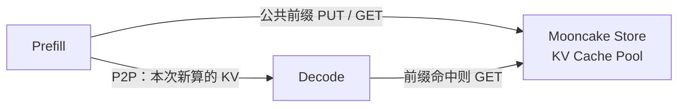
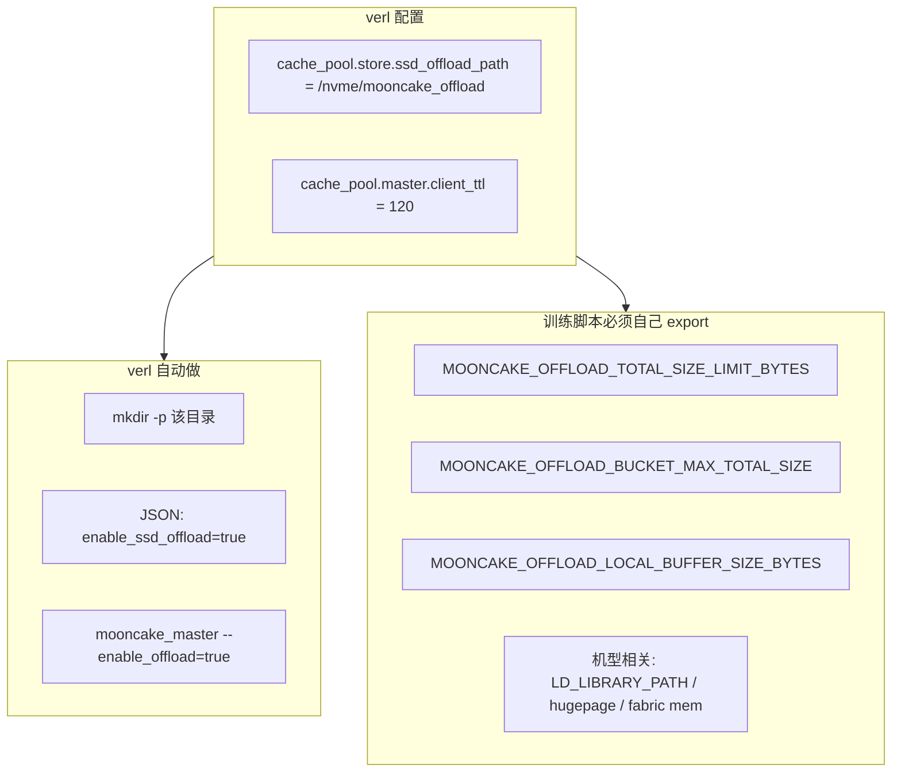
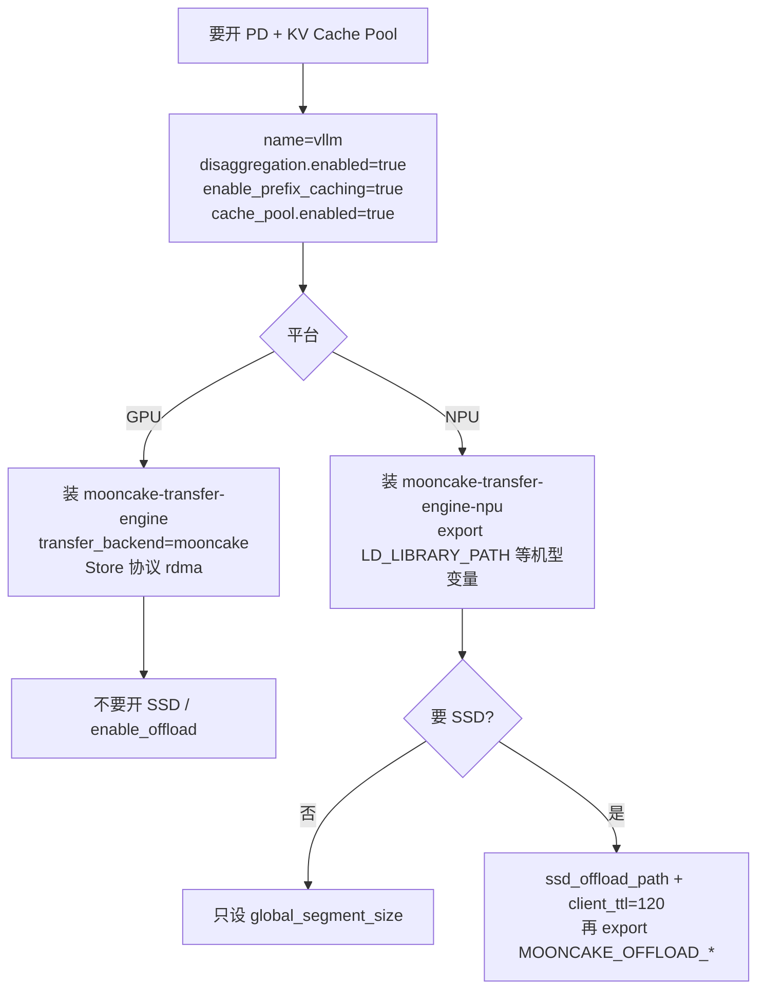

# vLLM PD 分离开启 KV Cache Pool（用户指南）

适用场景：`rollout.name=vllm` 且 **Prefill / Decode 分离（PD）**。  
本文只讲怎么开，不讲实现细节。

上游参考：

- GPU：[MooncakeStoreConnector Usage Guide](https://docs.vllm.ai/en/latest/features/mooncake_store_connector_usage/)
- NPU：[KV Cache Pool（Ascend Store）Deployment Guide](https://docs.vllm.ai/projects/ascend/en/latest/user_guide/feature_guide/kv_pool.html)

---

## 1. 它做什么

PD 打开后，verl 会给每个 Prefill / Decode 实例组装：

```text
MultiConnector = [P2P 连接器, Store 连接器]
```



- **P2P**：这次请求里，Prefill 把刚算出的 KV 直接传给 Decode。
- **Pool**：同一 Ray Job 里所有 P/D 实例共享一块 Mooncake 存储。系统提示、工具历史、`rollout.n` 多样本等公共前缀命中后，不必反复 prefill。

| 平台 | P2P | Store |
|---|---|---|
| GPU | `MooncakeConnector` | `MooncakeStoreConnector` |
| NPU | `MooncakeConnectorV1` | `AscendStoreConnector` |

不要同时走非 PD 旁路：不要再设 `engine_kwargs.vllm.kv_transfer_config`。PD replica 会自己生成这份配置，两边一起开会报错。

---

## 2. 公共前置条件

YAML 里至少满足：

```yaml
actor_rollout_ref.rollout:
  name: vllm
  enable_prefix_caching: true
  disaggregation:
    enabled: true
    transfer_backend: mooncake   # NPU 写 nixl 也会回退到 mooncake；GPU 开 Pool 必须是 mooncake
  cache_pool:
    enabled: true
```

verl 默认会做这些事，一般不用手写 JSON、不用手起 `mooncake_master`：

| 自动完成 | 说明 |
|---|---|
| 拉起 / 复用 `mooncake_master` | `cache_pool.master.auto_start=true`（默认）。同一 Ray Job 共用一个 master |
| 写 Mooncake JSON | 默认路径 `{临时目录}/verl_mooncake_{job_id}.json` |
| 注入 `MOONCAKE_CONFIG_PATH` | 指向上面这份 JSON |
| 注入 `PYTHONHASHSEED` | 默认 `0`，保证跨进程 block hash 一致 |

verl **不会**注入硬件相关环境变量（`LD_LIBRARY_PATH`、`ASCEND_GLOBAL_RESOURCE_CONFIG`、hugepage、`MOONCAKE_OFFLOAD_*` 等）。这些请写在训练脚本 / 镜像 / Ray runtime env 里，并在 `ray.init()` 之前 export，以便 worker 继承。

`auto_start=true` 时，`mooncake_master` 必须在 PATH 上：

```bash
# GPU
pip install mooncake-transfer-engine

# NPU（版本按 vLLM-Ascend 指南；非默认 tenant_id 需要 >= 0.3.12）
pip install mooncake-transfer-engine-npu==0.3.11.post1 \
  --extra-index-url https://mirrors.aliyun.com/pypi/web/simple
```

建议 vLLM ≥ 0.22。更旧的版本在权重更新后可能清不干净 Store 里的旧 KV。

---

## 3. GPU 怎么开

### 3.1 软件

```bash
pip install mooncake-transfer-engine
```

Store 默认走 **RDMA**（`cache_pool.store.protocol` 为空时写成 `rdma`）。机器上要有可用的 RDMA 网卡；调试可用 `tcp`，性能较差。  
P2P 默认走 `disaggregation.mooncake_protocol=nvlink`，和 Store 协议互相独立。

### 3.2 最小配置

```yaml
actor_rollout_ref.rollout:
  name: vllm
  tensor_model_parallel_size: 4
  enable_prefix_caching: true
  disaggregation:
    enabled: true
    transfer_backend: mooncake
    decode_replicas: 3
    decode_tensor_model_parallel_size: 2   # 可与 Prefill TP 不同
  cache_pool:
    enabled: true
    store:
      global_segment_size: 4GB    # 每张卡贡献给 Pool 的 CPU 段
      local_buffer_size: 4GB
      protocol: rdma              # 可省略，默认 rdma
      device_name: ""             # 指定网卡时填写，例如 mlx5_0
```

非对称 TP 时，verl 会把 GPU Store 的 `store_tp_size` 设为 `lcm(prefill_tp, decode_tp)`，一般不用手填。

可选：Decode 也把新生成的 decode KV 写回 Pool：

```yaml
cache_pool:
  connector:
    save_decode_cache: true
```

### 3.3 GPU 暂不支持 SSD Offload

当前 verl GPU 路径只支持 **embedded CPU Pool**，对应上游文档里 `"enable_offload": false` 的配置。

下面这些都会直接失败：

| 配置 | 结果 |
|---|---|
| `cache_pool.store.enable_offload=true` | `NotImplementedError` |
| `cache_pool.store.ssd_offload_path` 非空 | `ValueError` |
| `cache_pool.store.mode=standalone-store` | `ValueError`（verl 只实现 embedded） |

因此：

- **不要**给 GPU 配 SSD 路径。
- **不要**指望 verl 去起外部 `mooncake_client`。
- **不要**设置 `MOONCAKE_OFFLOAD_FILE_STORAGE_PATH` 来“绕过”开关——verl 不会把它写进 GPU JSON。

上游 GPU 磁盘卸载需要 `standalone-store` + `mooncake_client --enable_offload=true`，这条路径本阶段未接入。GPU 上 KV 只进 CPU 段（`global_segment_size`），容量不够就调大这段，或加机器，而不是开 SSD。

---

## 4. NPU 怎么开

### 4.1 软件与硬件环境

官方依赖（以 vLLM-Ascend 指南为准）：

- CANN ≥ 8.5.0（A3 / 950 上 Store 与 PD 分流需要 CANN ≥ 9.1.0）
- vLLM / vLLM-Ascend main
- Mooncake ≥ 0.3.11.post1
- 确认 `/etc/hccn.conf` 存在（容器内要挂进去）

训练脚本里按机型补环境变量（**verl 不会代写**）：

```bash
# 所有节点都要一致
export PYTHONHASHSEED=0   # 开 Pool 后 verl 也会注入；脚本里先写上更稳妥

# Mooncake 动态库（按实际安装路径改）
export LD_LIBRARY_PATH=/usr/local/Ascend/ascend-toolkit/latest/python/site-packages/mooncake:$LD_LIBRARY_PATH

source /usr/local/Ascend/ascend-toolkit/set_env.sh
source /usr/local/Ascend/nnal/atb/set_env.sh
```

按系列再补：

| 系列 | 建议 export / 系统项 |
|---|---|
| A2（RoCE） | `HCCL_IF_IP`、`GLOO_SOCKET_IFNAME`、`TP_SOCKET_IFNAME`、`HCCL_SOCKET_IFNAME`、`HCCL_INTRA_ROCE_ENABLE=1`；`echo 200000 > /proc/sys/vm/nr_hugepages` |
| A3 + HCCS | `ACL_OP_INIT_MODE=1`、`ASCEND_ENABLE_USE_FABRIC_MEM=1` |
| A3 + RoCE | 与 A2 相同的网卡 / hugepage 项 |
| 950（A5）UBOE | `ASCEND_GLOBAL_RESOURCE_CONFIG='{"comm_resource_config.protocol_desc":["uboe:device"]}'` |
| 950 UB | `ASCEND_LOCAL_COMM_RES='{"version":"1.3"}'` |

A3 / 950 若要把 **PD 流量** 和 **Store 流量** 分到不同链路，设置 `ASCEND_GLOBAL_RESOURCE_CONFIG` 的顶层（P2P）和 `store` 段（Pool）。详见上游 5.6 节。

### 4.2 最小配置（只用 CPU Pool，不开 SSD）

```yaml
actor_rollout_ref.rollout:
  name: vllm
  tensor_model_parallel_size: 4
  enable_prefix_caching: true
  disaggregation:
    enabled: true
    transfer_backend: mooncake
    decode_replicas: 3
  cache_pool:
    enabled: true
    store:
      global_segment_size: 4GB   # NPU 必须 1GB 对齐：4GB / 1024MB / 1073741824 均可
```

NPU Store 协议固定为 `ascend`，`device_name` 必须保持空字符串。verl 不会把 GPU 的 `store_tp_size` 写进 NPU 连接器。

可选：Decode 也把 KV 写入 Pool（MLA 等场景，对应上游 `consumer_is_to_put`）：

```yaml
cache_pool:
  connector:
    consumer_is_to_put: true
```

KV 从 Pool 加载失败时，默认跟 vLLM 一样是 `fail`。若希望回退重算：

```yaml
cache_pool:
  kv_load_failure_policy: recompute   # 部分混合注意力模型暂不支持
```

---

## 5. NPU 开启 SSD Offload

NPU 走 **embedded 客户端**：不需要单独的 `mooncake_client`。vLLM 进程启动时按 JSON 完成 `MooncakeDistributedStore.setup()`。



### 5.1 YAML（必配）

开关就是 **`ssd_offload_path` 非空**。verl 看到路径后会：

1. JSON 写入 `"enable_ssd_offload": true` 和 `"ssd_offload_path": ...`
2. 自动 `mkdir -p`
3. 拉起 master 时带 `--enable_offload=true`

路径必须是 **绝对路径**，不能是相对路径、符号链接或含 `..`。每个节点都要能写这个目录（本地 NVMe 即可，不要求 NFS）。

```yaml
actor_rollout_ref.rollout:
  name: vllm
  tensor_model_parallel_size: 8
  enable_prefix_caching: true
  disaggregation:
    enabled: true
    transfer_backend: mooncake
    decode_replicas: 3
  cache_pool:
    enabled: true
    store:
      global_segment_size: 4GB
      ssd_offload_path: /nvme/mooncake_offload
    master:
      # 官方 SSD 指南强烈建议；verl 不会自动填
      client_ttl: 120
      # 可选：租约要大于 Ascend 传输超时
      # default_kv_lease_ttl: 11000
```

不要设 `cache_pool.store.enable_offload`——那是 GPU JSON 字段，NPU 忽略它。NPU SSD 只看 `ssd_offload_path`。

### 5.2 环境变量（必配 / 强烈建议）

这些 **不会** 出现在 YAML 里，也不会由 verl 注入。开 SSD 前在训练入口 export。

**磁盘配额（强烈建议覆盖默认值）：**

Mooncake 默认把每 rank 上报成 2 TB。8 卡就会在监控里显示约 16 TB，真实盘可能只有 1 TB，盘满了才会失败。按「盘容量 / rank 数」设置：

```bash
# 例：800 GB NVMe，8 个 TP rank → 每 rank 约 100 GB
export MOONCAKE_OFFLOAD_TOTAL_SIZE_LIMIT_BYTES=$((100 * 1024 * 1024 * 1024))
export MOONCAKE_OFFLOAD_BUCKET_MAX_TOTAL_SIZE=$((100 * 1024 * 1024 * 1024))
export MOONCAKE_OFFLOAD_BUCKET_EVICTION_POLICY=lru   # none | fifo | lru
```

| 变量 | 默认 | 作用 |
|---|---|---|
| `MOONCAKE_OFFLOAD_TOTAL_SIZE_LIMIT_BYTES` | 2 TB / rank | 向 master 申报的每 rank 磁盘上限，**务必改成真实容量** |
| `MOONCAKE_OFFLOAD_BUCKET_MAX_TOTAL_SIZE` | `0`（约等于物理盘 90%） | 单 rank 逐出阈值 |
| `MOONCAKE_OFFLOAD_BUCKET_EVICTION_POLICY` | `none` | 盘满后：直接失败 / FIFO / LRU |
| `MOONCAKE_OFFLOAD_LOCAL_BUFFER_SIZE_BYTES` | 1280 MB | 每 rank SSD 读写缓冲。**只接受纯字节数字**，`10GB` 这种写法会被忽略 |

各 TP rank 会在 `ssd_offload_path` 下写 `rank_0/`、`rank_1/` …，共享同一块物理盘。

**SSD 读写缓冲：**

遇到 `BUFFER_OVERFLOW`（`error_code=-10`）时加大 `MOONCAKE_OFFLOAD_LOCAL_BUFFER_SIZE_BYTES`。加大 `global_segment_size` **解决不了** 这个问题。取值不要超过 vLLM worker 日志里的 `Available KV cache memory`。

```bash
export MOONCAKE_OFFLOAD_LOCAL_BUFFER_SIZE_BYTES=1073741824   # 1 GiB
```

**A3 且 `ASCEND_ENABLE_USE_FABRIC_MEM=1`：**

`global_segment_size` 和 `MOONCAKE_OFFLOAD_LOCAL_BUFFER_SIZE_BYTES` 都必须 **1GB 对齐**。默认 1280 MB 未对齐，SSD 初始化可能直接 segfault。配额粗算：

```text
fabric_memory.max_capacity(GB) ≥ global_segment_size + MOONCAKE_OFFLOAD_LOCAL_BUFFER_SIZE_BYTES + 余量
```

不够时再设（单位 GB / 每进程）：

```bash
export ASCEND_ENABLE_USE_FABRIC_MEM=1
export MOONCAKE_OFFLOAD_LOCAL_BUFFER_SIZE_BYTES=1073741824
export ASCEND_GLOBAL_RESOURCE_CONFIG='{"fabric_memory.max_capacity":32}'
```

### 5.3 和官方指南的对应关系

官方要你对齐三件事，verl 在 NPU embedded 模式下对应如下：

| 官方要求 | verl 行为 | 你还要做什么 |
|---|---|---|
| `mooncake.json` 里 `enable_ssd_offload` + `ssd_offload_path` | 由 `store.ssd_offload_path` 生成 | 填绝对路径 |
| `mooncake_master --enable_offload=true` | `auto_start=true` 时自动加 | 设 `master.client_ttl=120`，避免 `SEGMENT_NOT_FOUND` |
| 独立 `mooncake_client` | **不需要**（embedded） | — |
| `MOONCAKE_OFFLOAD_*` | 不注入 | 训练脚本 export |
| 目录必须存在且可写 | `launch_server` 前 `mkdir -p` | 保证路径在本地盘上、节点可写 |

开 SSD 后若日志出现 `OffloadObjectHeartbeat failed ... SEGMENT_NOT_FOUND`，多半是 master 默认 `client_ttl=10` 过短。把 `cache_pool.master.client_ttl` 提到 `60`–`120`，并和 vLLM 一起重启 master（不要只重启一边）。

---

## 6. 常用可选配置

| 项 | 含义 |
|---|---|
| `cache_pool.store.global_segment_size` | 每卡贡献给 Pool 的 CPU 段。NPU 必须 1GB 对齐 |
| `cache_pool.python_hash_seed` | 写入所有 P/D 的 `PYTHONHASHSEED`，默认 `0` |
| `cache_pool.master.auto_start=false` | 复用外部 master，同时给 `master.address` 或 `store.config_path` |
| `cache_pool.store.tenant_id` | 多租户命名空间；非 `default` 需要 Mooncake ≥ 0.3.12 |
| `cache_pool.kv_load_failure_policy` | `recompute` / `fail`；空则沿用 vLLM 默认 `fail` |

复用外部 master 时：

```yaml
cache_pool:
  enabled: true
  master:
    auto_start: false
    address: "10.0.0.1:50051"
```

`auto_start=true` 和 `store.config_path` 不能一起用。

---

## 7. 权重更新

每轮策略更新后，verl 会在每台 P/D `vLLMHttpServer` 上调用 `reset_prefix_cache(reset_connector=True)`，清掉本地 prefix cache 和 Store 连接器里的旧 KV。不需要自己去 flush `mooncake_master`。

---

## 8. 快速对照


